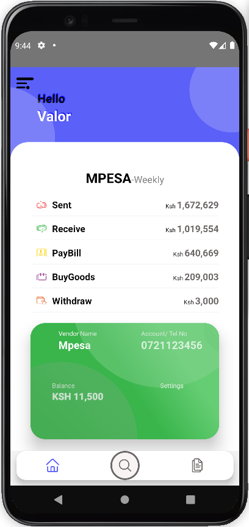
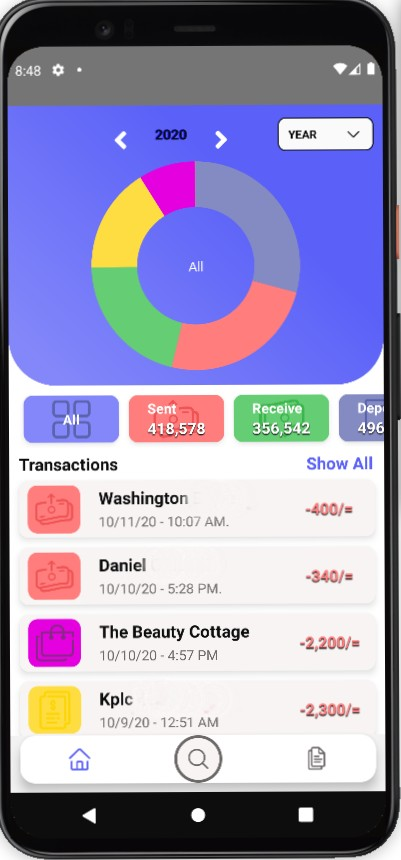
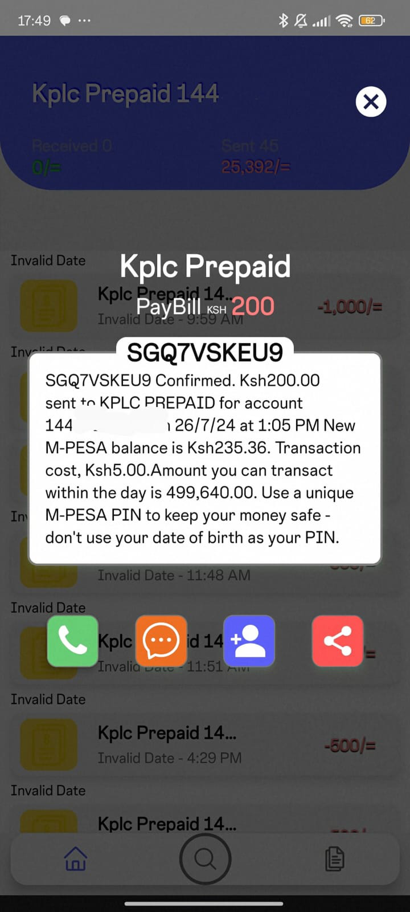
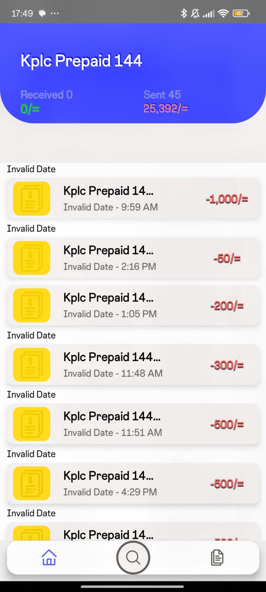

# PESAWALLET- Financial Analyzer

Financial Analyzer is a mobile application built on React Native that analyzes your financial SMS messages to create organized and searchable financial statements.
This application supports various login methods and provides several useful features for managing your financial transactions.

## Table of Contents

1. [Features](#features)
2. [Screenshots](#screenshots)
3. [Technologies Used](#technologies-used)
4. [Usage](#usage)
5. [Download](#download)
6. [License](#license)
7. [Contact](#contact)

## Features

| Feature                                | Description                                                            |
| -------------------------------------- | ---------------------------------------------------------------------- |
| OTP Login                              | Secure login using One-Time Password (OTP).                            |
| Social Login                           | Login using popular social media accounts.                             |
| M-Pesa Integrated Financial Statements | Automatically generates financial statements from M-Pesa transactions. |
| Clickable Filter                       | Filter transactions by name or company.                                |

- Sign In with Google
- OTP SignIN
- Mpesa Transaction
- Graph Details
- Among Others

## Screenshots

### OTP Login

### Social Login

### M-Pesa Integrated Financial Statements

### Transaction Preview

### Clickable Filter

### Transaction Management

## Technologies Used

### Core Framework and Libraries

- **React Native**: Framework for building native apps using React.
- **Redux**: State management library.
- **React Navigation**: Routing and navigation for the app.
- **Axios**: Promise-based HTTP client for making API requests.
- **Formik**: Form library for React and React Native.
- **Yup**: Schema builder for value parsing and validation.

### Firebase

- **@react-native-firebase/analytics**: Firebase analytics for React Native.
- **@react-native-firebase/app**: Firebase core functionality.
- **@react-native-firebase/auth**: Firebase authentication.
- **@react-native-firebase/firestore**: Firebase Cloud Firestore.

### Authentication

- **@twotalltotems/react-native-otp-input**: OTP input component.
- **@react-native-google-signin/google-signin**: Google Sign-In for React Native.

### UI Components and Styling

- **react-native-vector-icons**: Customizable icons for React Native.
- **react-native-animatable**: Declarative transitions and animations.
- **react-native-svg**: SVG library for React Native.
- **styled-components**: Visual primitives for the component age.
- **react-native-modal**: Modal component for React Native.
- **react-native-dropdown-picker**: Dropdown picker for React Native.

### Parallax and Scroll

- **@monterosa/react-native-parallax-scroll**: Parallax scroll for React Native.
- **react-native-parallax-header**: Parallax header for React Native.
- **react-native-parallax-scroll-view**: Parallax scroll view for React Native.

### Charts and Visualization

- **react-native-chart-kit**: Chart kit for React Native.
- **victory-native**: Charting library for React Native.

### Other Utilities

- **@react-native-async-storage/async-storage**: Unencrypted, asynchronous, persistent, key-value storage for React Native.
- **@react-native-community/netinfo**: Network information library for React Native.
- **react-native-safe-area-context**: Handling safe area insets in React Native.
- **react-native-webview**: WebView component for React Native.
- **react-native-reanimated**: Animated library for React Native.
- **libphonenumber-js**: Parsing, formatting, and validating international phone numbers.

## Usage

1. **Login**: Start the app and choose your preferred login method (OTP or Social Login).
2. **Analyze SMS**: The app will automatically analyze your financial SMS messages.
3. **View Statements**: Navigate to the 'Statements' section to view organized financial statements.
4. **Filter Transactions**: Use the filter feature to find transactions by name or company.
5. **Manage Transactions**: Click on any transaction to view details, share it, or make a call related to the transaction.

## Download

Download the latest PesaWallet APK from the [Releases](release/PesaWallet.apk) page.

## License

MIT (c) 2022 [Ian Adera](https://github.com/ianodad)

## Contact

- **Author**: Ian Adera
- **Email**: <ianodad@gmail.com>
- **GitHub**: [ianodad](https://github.com/ianodad)
